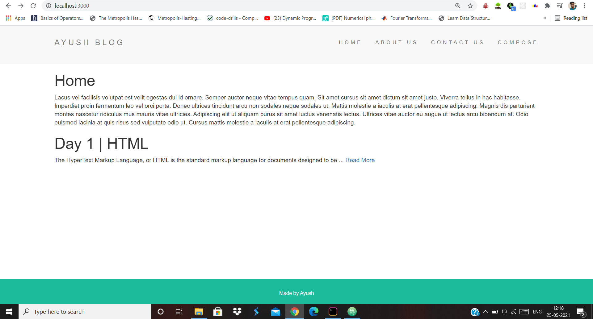
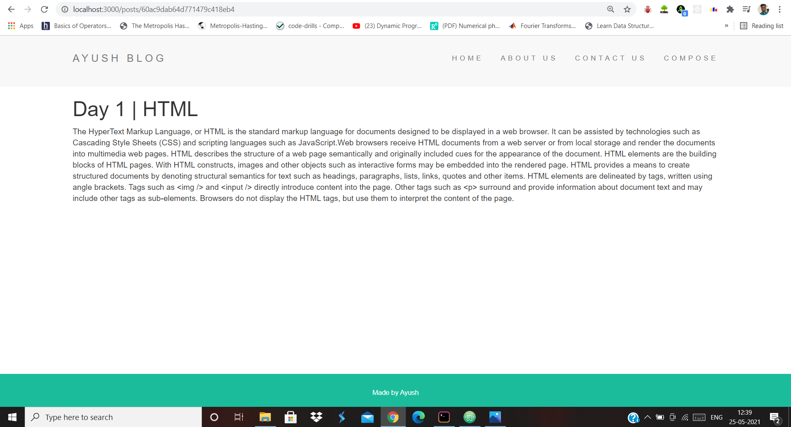
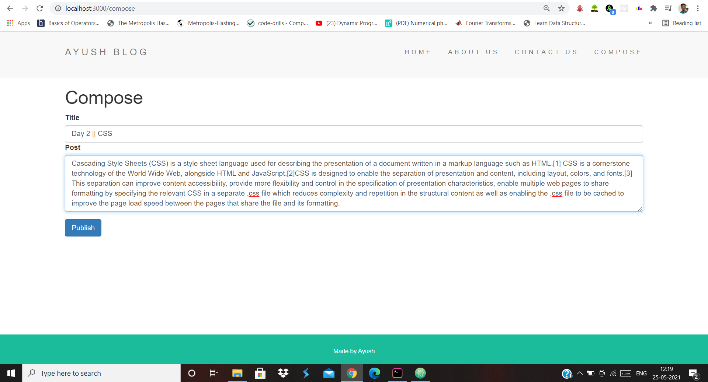
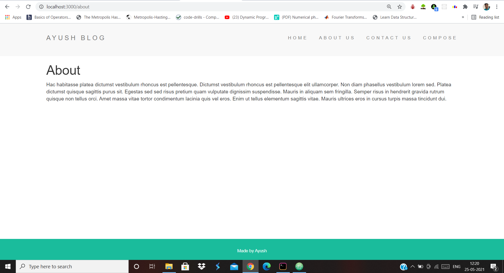
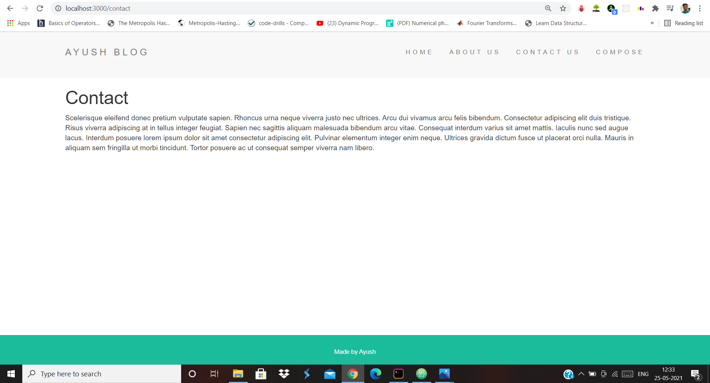

# Blog-Website
Blog Website (EJS, Node.js, Express.js, Lodash , MongoDB)

BUILT A FULL-STACK PERSONNEL BLOG WEBSITE WHERE BLOG POSTS ARE KEPT IN SEPARATE PAGES ( USING EJS )
AS WELL AS ON HOME SCREEN IN CHRONOLOGICAL ORDER (USING MONGODB) TRUNCATED TO 100 CHARACTERS.

Home page with an already added Blog ==>

Separate page for whole Blog ==>

Composing a new Blog ==>

Home Page after change ==>

About Us Page ==>

Contact Page ==>

EVEN IF WE RESTART THE SERVER DATA WON'T DISSAPPEAR.

